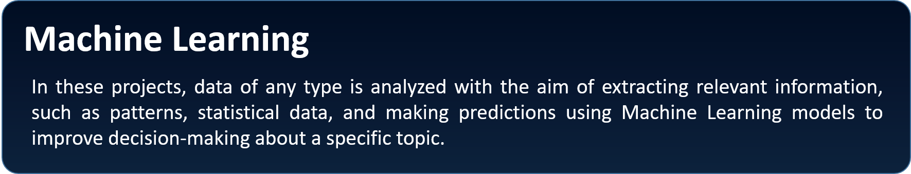

  

## 🌟 WHO AM I:

<h4 align="justify">
I'm a Mechatronic Engineer with a master's degree in renewable energies with a specialty in green hydrogen.
  
I specialize in data science, analyzing large volumes of data, restructuring and organizing it to develop and train Machine Learning models to obtain predictions. In addition to doing a statistical analysis and identifying hidden patterns to improve the understanding of the DataSet and improve decision making.
</h4> 

## 📝SKILLS:
### Programming languages:

  <table><tr>
    <td align="center"><a href="https://www.python.org/doc/"></td>
    <td align="center"><a href="https://www.oracle.com/co/database/technologies/appdev/sql.html"></td>
    <td align="center"><a href="https://www.r-project.org"></td>
    <td align="center"><a href="https://isocpp.org/std/the-standard"></td>
    <td align="center"><a href="https://html.com/document/"></td>
    <td align="center"><a href="https://devdocs.io/css/"></td>
    <td align="center"><a href="https://www.mathworks.com"></td>
    <td align="center"><a href="https://kotlinlang.org"></td>
    <td align="center"><a href="https://www.arduino.cc"></td>
    <td align="center"><a href="https://www.raspberrypi.com"></td>
  </tr>
    
  <tr>
    <td align="center"><a style="font-size:10px" href="https://www.python.org/doc/">Python</a></td>
    <td align="center"><a style="font-size:10px" href="https://www.oracle.com/co/database/technologies/appdev/sql.html">SQL</a></td>
    <td align="center"><a style="font-size:10px" href="https://www.r-project.org">R</a></td>
    <td align="center"><a style="font-size:10px" href="https://isocpp.org/std/the-standard">C++</a></td>
    <td align="center"><a style="font-size:10px" href="https://html.com/document/">HTML</a></td>
    <td align="center"><a style="font-size:10px" href="https://devdocs.io/css/">CSS</a></td>
    <td align="center"><a style="font-size:10px" href="https://www.mathworks.com">Matlab</a></td>
    <td align="center"><a style="font-size:10px" href="https://kotlinlang.org">Kotlin</a></td>
    <td align="center"><a style="font-size:10px" href="https://www.arduino.cc">Arduino</a></td>
    <td align="center"><a style="font-size:10px" href="https://www.raspberrypi.com">Raspberry</a></td>
  </tr></table> 

## 💻 PROJECTS:

<table><tr>
  <td></td>
  <td></td>
  <td></td>
</tr></table> 

 

 

I love the entire process of developing creative websites. I love the challenge of finding caches and spending time to meet new people. Learning how people hide things and where people are likely to look.

### 🤝 Connect with me:

 
- 💬 If you have any question/feedback, please do not hesitate to reach out to me!

## 🔭 I'm currently working on

- My old projects
- Restaurant Recommendation App (React-Native)
- Mobile + Desktop Spotify Clone (Working on it soon...)
- My next blog
- My CSS skill

## 🌱 I'm currently learning

- 📱 React Native
- Firebase
- React Context API
- Styled Components  

## 📝 Latest Blog Posts

- [Deploy Rails API Backend to Heroku and React Frontend to Netlify](https://yushi95.medium.com/deploy-rails-api-backend-to-heroku-and-react-frontend-to-netlify-b515239d5022)
- [Animation Login Popup Form by Using React State Hook and CSS](https://medium.com/geekculture/animation-login-popup-form-by-using-react-state-hook-and-css-7ecf803f1fa9)
- [Checklist ✅ for Rails Application](https://yushi95.medium.com/checklist-for-rails-application-30868cb4f48b)
- [Self and Operator in Ruby](https://blog.usejournal.com/self-in-ruby-5e8a91fa4602)

## 📈 GitHub Stats 

