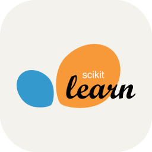

  

## 🌟 WHO AM I:

<h4 align="justify">
I'm a Mechatronic Engineer with a master's degree in renewable energies with a specialty in green hydrogen.
  
I specialize in data science, analyzing large volumes of data, restructuring and organizing it to develop and train Machine Learning models to obtain predictions. In addition to doing a statistical analysis and identifying hidden patterns to improve the understanding of the DataSet and improve decision making.
</h4> 

## 📝SKILLS:
### Programming languages:

  <table><tr>
    <td align="center"><a href="https://www.python.org/doc/"></td>
    <td align="center"><a href="https://www.oracle.com/database/technologies/appdev/sql.html"></td>
    <td align="center"><a href="https://www.r-project.org"></td>
    <td align="center"><a href="https://isocpp.org/std/the-standard"></td>
    <td align="center"><a href="https://html.com/document/"></td>
    <td align="center"><a href="https://devdocs.io/css/"></td>
    <td align="center"><a href="https://www.mathworks.com"></td>
    <td align="center"><a href="https://kotlinlang.org"></td>
    <td align="center"><a href="https://www.arduino.cc"></td>
    <td align="center"><a href="https://www.raspberrypi.com"></td>
  </tr>
    
  <tr>
    <td align="center"><a style="font-size:10px" href="https://www.python.org/doc/">Python</a></td>
    <td align="center"><a style="font-size:10px" href="https://www.oracle.com/database/technologies/appdev/sql.html">SQL</a></td>
    <td align="center"><a style="font-size:10px" href="https://www.r-project.org">R</a></td>
    <td align="center"><a style="font-size:10px" href="https://isocpp.org/std/the-standard">C++</a></td>
    <td align="center"><a style="font-size:10px" href="https://html.com/document/">HTML</a></td>
    <td align="center"><a style="font-size:10px" href="https://devdocs.io/css/">CSS</a></td>
    <td align="center"><a style="font-size:10px" href="https://www.mathworks.com">Matlab</a></td>
    <td align="center"><a style="font-size:10px" href="https://kotlinlang.org">Kotlin</a></td>
    <td align="center"><a style="font-size:10px" href="https://www.arduino.cc">Arduino</a></td>
    <td align="center"><a style="font-size:10px" href="https://www.raspberrypi.com">Raspberry</a></td>
  </tr></table> 

### Machine Learning Tools:

  <table><tr>
  <td align="center"><a href="https://pandas.pydata.org"></td>
    <td align="center"><a href="https://scikit-learn.org/stable/"></td>
    <td align="center"><a href="https://pytorch.org"></td>
    <td align="center"><a href="https://www.tensorflow.org"></td>
    <td align="center"><a href="https://keras.io"></td>
    <td align="center"><a href="https://matplotlib.org"></td>
    <td align="center"><a href="https://numpy.org"></td>
    <td align="center"><a href="https://seaborn.pydata.org"></td>
    <td align="center"><a href="https://www.latex-project.org"></td>
    <td align="center"><a href="https://www.mysql.com"></td>
  </tr>
    
  <tr>
    <td align="center"><a style="font-size:10px" href="https://pandas.pydata.org">Pandas</a></td>
    <td align="center"><a style="font-size:10px" href="https://scikit-learn.org/stable/">SciKitLearn</a></td>
    <td align="center"><a style="font-size:10px" href="https://pytorch.org">PyTorch</a></td>
    <td align="center"><a style="font-size:10px" href="https://www.tensorflow.org">TensorFlow</a></td>
    <td align="center"><a style="font-size:10px" href="https://keras.io">Keras</a></td>
    <td align="center"><a style="font-size:10px" href="https://matplotlib.org">MatplotLib</a></td>
    <td align="center"><a style="font-size:10px" href="https://numpy.org">Numpy</a></td>
    <td align="center"><a style="font-size:10px" href="https://seaborn.pydata.org">Seaborn</a></td>
    <td align="center"><a style="font-size:10px" href="https://www.latex-project.org">Latex</a></td>
    <td align="center"><a style="font-size:10px" href="https://www.mysql.com">MySQL</a></td>
  </tr></table> 

### Image Detection Tools:

  <table><tr>
  <td align="center"><a href="https://opencv.org"></td>
    <td align="center"><a href="https://numpy.org"></td>
    <td align="center"><a href="https://pillow.readthedocs.io/en/stable/"></td>
    <td align="center"><a href="https://scikit-image.org"></td>
    <td align="center"><a href="https://scipy.org"></td>
  </tr>
    
  <tr>
    <td align="center"><a style="font-size:10px" href="https://opencv.org">OpenCV</a></td>
    <td align="center"><a style="font-size:10px" href="https://numpy.org">Numpy</a></td>
    <td align="center"><a style="font-size:10px" href="https://pillow.readthedocs.io/en/stable/">PIL</a></td>
    <td align="center"><a style="font-size:10px" href="https://scikit-image.org">Scikit-Image</a></td>
    <td align="center"><a style="font-size:10px" href="https://scipy.org">Scipy</a></td>
  </tr></table> 

### Probability and Statistics Tools:

  <table><tr>
    <td align="center"><a href="https://www.microsoft.com/es-es/power-platform/products/power-bi"></td>
    <td align="center"><a href="https://pandas.pydata.org"></td>
    <td align="center"><a href="https://www.mysql.com"></td>
    <td align="center"><a href="https://numpy.org"></td>
    <td align="center"><a href="https://matplotlib.org"></td>
    <td align="center"><a href="https://www.statsmodels.org/stable/index.html"></td>
    <td align="center"><a href="https://scipy.org"></td>
    <td align="center"><a href="https://seaborn.pydata.org"></td>
  </tr>
    
  <tr>
    <td align="center"><a style="font-size:10px" href="https://www.microsoft.com/es-es/power-platform/products/power-bi">PowerBI</a></td>
    <td align="center"><a style="font-size:10px" href="https://pandas.pydata.org">Pandas</a></td>
    <td align="center"><a style="font-size:10px" href="https://www.mysql.com">MySQL</a></td>
    <td align="center"><a style="font-size:10px" href="https://numpy.org">Numpy</a></td>
    <td align="center"><a style="font-size:10px" href="https://matplotlib.org">MatplotLib</a></td>
    <td align="center"><a style="font-size:10px" href="https://www.statsmodels.org/stable/index.html">StatsModels</a></td>
    <td align="center"><a style="font-size:10px" href="https://scipy.org">Scipy</a></td>
    <td align="center"><a style="font-size:10px" href="https://seaborn.pydata.org">Seaborn</a></td>
  </tr></table> 

### Engineering Tools:

  <table><tr>
    <td align="center"><a href="https://www.solidworks.com"></td>
    <td align="center"><a href="https://www.arduino.cc"></td>
    <td align="center"><a href="https://www.raspberrypi.com"></td>
    <td align="center"><a href="https://www.labcenter.com"></td>
    <td align="center"><a href="https://developer.android.com/studio"></td>
    <td align="center"><a href="https://www.docker.com"></td>
    <td align="center"><a href="https://unity.com"></td>
    <td align="center"><a href="https://discord.com"></td>
    <td align="center"><a href="https://top.gg"></td>
  </tr>
    
  <tr>
  <td align="center"><a style="font-size:10px" href="https://www.solidworks.com">SolidWorks</a></td>
    <td align="center"><a style="font-size:10px" href="https://www.arduino.cc">Arduino</a></td>
    <td align="center"><a style="font-size:10px" href="https://www.raspberrypi.com">Raspberry</a></td>
    <td align="center"><a style="font-size:10px" href="https://www.labcenter.com">Proteus</a></td>
    <td align="center"><a style="font-size:10px" href="https://developer.android.com/studio">Android_Studio</a></td>
    <td align="center"><a style="font-size:10px" href="https://www.docker.com">Docker</a></td>
    <td align="center"><a style="font-size:10px" href="https://unity.com">Unity</a></td>
    <td align="center"><a style="font-size:10px" href="https://discord.com">Discord</a></td>
    <td align="center"><a style="font-size:10px" href="https://top.gg">Discord_Bots</a></td>
  </tr></table> 

   

## 💻 PROJECTS:

<h2 align="center">⬇️⬇️ Choose one to see them ⬇️⬇️
 

<table><tr>
  <td><a href="https://github.com/AlejandroSilvaR/Machine_Learning"></td>
  <td><a href="https://github.com/AlejandroSilvaR/Probability"></td>
  <td><a href="https://github.com/AlejandroSilvaR/Image_Detection"></td>
</tr></table> 

  

### 📋 Portfolio:

 

### 🤝 Connect with me:

  

 💬 If you have any question/feedback, please do not hesitate to reach out to me! 
